# lab2 单周期MIP处理器

## 实验目的

* 熟悉Vivado软件
* 熟悉在Vivado软件下进行硬件设计的流程
* 设计单周期MIPS处理器，包括：
  * 完成单周期MIPS处理器的设计
  * 在Vivado软件上进行仿真
  * 编写MIPS代码验证单周期MIPS处理器
  * 在NEXYS4 DDR板上进行验证

## 实验任务

### 1.设计单周期MIPS处理器

代码框架如下：
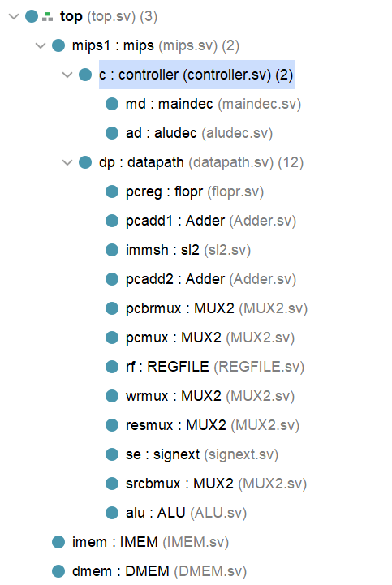

完整的单周期mips处理器：
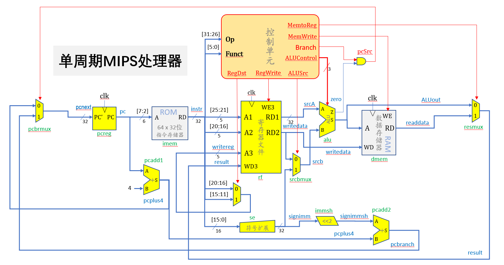

* 框架分析
  * controller:
  控制单元，分析处理指令中的op、func部分。
    * maindec: 内含名为ocntrols的变量（整合了若干输出，例如jump，aluop），根据op赋不同的值
    * aludec: 接受aluop与funct，输出alucontrol（控制alu行为）首先根据aluop判断是R型还是非R型指令。若为R型指令则根据funct为alucontrol赋值
  * datapath:
  数据通路，控制数据存储、处理与传送
    * ALU: 输入两个操作数和op，输出结果和zero（主要用于判断跳转指令）
    * MUX2: 二选一复用器，提供可选参数
    * signext: 符号扩展
    * sl2: 左移2位，寻址时偏移量的单位为指令条数，需要乘4转换为字节地址
    * regfile: 寄存器文件，两个读地址、两个写数据、一个写使能、一个写地址
    * adder: 32位加法器
    * flopr: 程序计数器PC
  
* 执行一条指令的步骤：
  * 根据PC值从指令存储器IMEM取指令
  * 将指令的op与funct字段传入controller模块进行译码并分配控制信号的值
  * 指令同时传入datapath模块，进行寄存器的读写，具体的操作由controller分配的控制信号决定（复用器值的选取、alu的操作）

* 主要代码

  主要列出对ppt上代码作出修改的部分

  ```verilog
  //maindec
  //为实现beq、bne
  assign { regwrite,regdst,alusrc,branchbeq,branchbne,memwrite,memtoreg,jump,aluop } = controls;

  assign pcsrc = (branchbeq & zero)|(branchbne & (!zero));

  //aluop扩大到三位，加入jump控制位，branch扩展为两位实现不同分支指令
  always_comb
  case(op)
      6'b000000:controls <= 11'b110_00_00_0_100; //r
      6'b100011:controls <= 11'b101_00_01_0_000; //lw
      6'b101011:controls <= 11'b001_00_10_0_000; //sw
      6'b000100:controls <= 11'b000_10_00_0_001; //beq   
      6'b000101:controls <= 11'b000_01_00_0_001; //bne
      6'b001000:controls <= 11'b101_00_00_0_000; //addi 001000
      6'b001100:controls <= 11'b101_00_00_0_010; //andi
      6'b001101:controls <= 11'b101_00_00_0_011; //ori
      6'b001010:controls <= 11'b101_00_00_0_101; //slti
      6'b000010:controls <= 11'b000_00_00_1_000; //j
      default:  controls <= 11'bxxxxxxxxxxx;
      endcase

    
  //aludec
  module aludec(
    input  logic [5:0] funct,
    input  logic [2:0] aluop,
    output logic [2:0] alucontrol
    );
    
    always_comb
    case(aluop)
        3'b000: alucontrol <= 3'b010; //lw/sw/addi
        3'b001: alucontrol <= 3'b110; //branch
        3'b010: alucontrol <= 3'b000; //andi
        3'b011: alucontrol <= 3'b001; //ori
        3'b101: alucontrol <= 3'b111; //slti
        3'b100: case(funct)
                6'b100000:alucontrol <= 3'b010; //add
                6'b100010:alucontrol <= 3'b110; //sub
                6'b100100:alucontrol <= 3'b000; //and
                6'b100101:alucontrol <= 3'b001; //or
                6'b101010:alucontrol <= 3'b111; //slt
                6'b000000:alucontrol <= 3'b000; //nop 
                default:  alucontrol <= 3'bxxx;
                endcase
     endcase
  endmodule
  ```

* 电路图
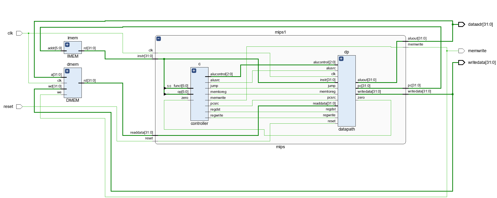

### 2.仿真

* 模块regfile测试

  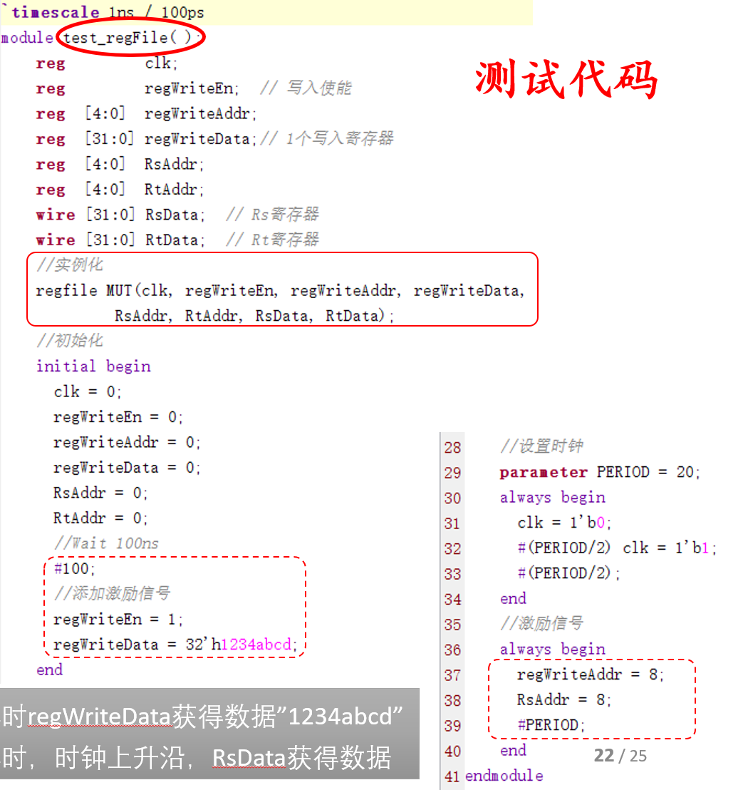

  运行结果：

  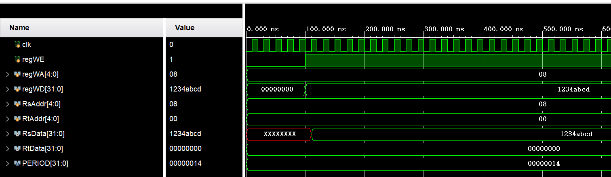

  100ns时regWriteData获得数据"1234abcd";
  110ns时，时钟上升沿，RsData获得数据

* 测试汇编代码+机器代码

  编写`memfile.dat`文件并导入，编写模拟文件`testbench.sv`
  * 仿真代码：
  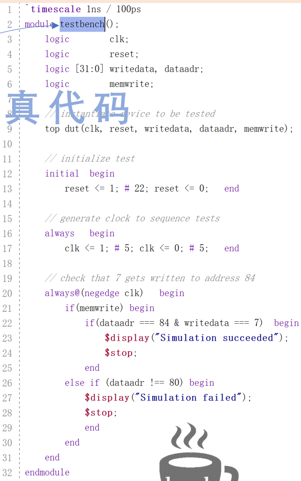

  * 运行结果
  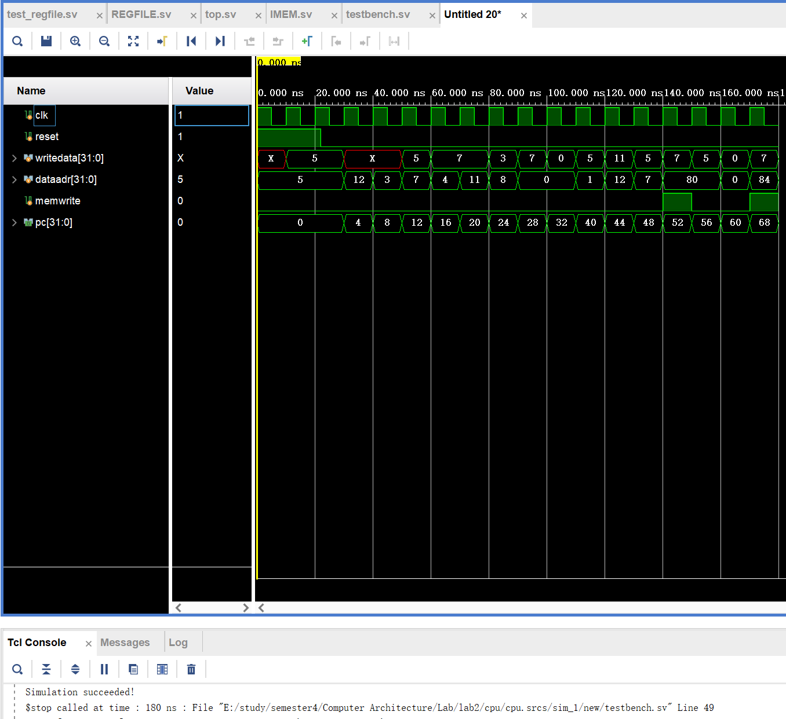

### 3.验证

* 编写mips代码并转为机器码验证。程序作用为对一个长度为5的数组求和

  ```mips
  or $8,$0,$0 # $8
  ori $9,$0,9 # $9
  sw $9,0($8)
  addi $8,$8,4
  ori $9,$0,7
  sw $9,0($8)
  addi $8,$8,4
  ori $9,$0,15
  sw $9,0($8)
  addi $8,$8,4
  ori $9,$0,19
  sw $9,0($8)
  addi $8,$8,4
  ori $9,$0,20
  sw $9,0($8)
  ori $10,$0,5 # $t2=5
  or $8,$0,$0 # $t0=0
  # index
  or $9,$0,$0 # $t1=0
  bne $10,S0,loop
  loop:
  slt $11,$9,$10 # if($t1<6) $t3=1
  beq $11,$0,exit
  add $12,$9,$9 #
  add $12,$12,$12 # $t4=4*$t1 018c6020
  lw $13,0($12)
  add $8,$8,$12
  # index++
  addi $9,$9,1
  j loop
  exit:
  sw $8,84($0)
  ```

* 转为机器码

  ```asm
  00004025
  34090009
  ad090000
  21080004
  34090007
  ad090000
  21080004
  3409000f
  ad090000
  21080004
  34090013
  ad090000
  21080004
  34090014
  ad090000
  340a0005
  00004025
  00004825
  140a0000
  012a582a
  100b0006
  01296020
  018c6020
  8d8d0000
  010d4020
  21290001
  08000013
  ac080054
  ```

* 运行结果
  * 修改testbench，预期结果为70。最终测试成功

  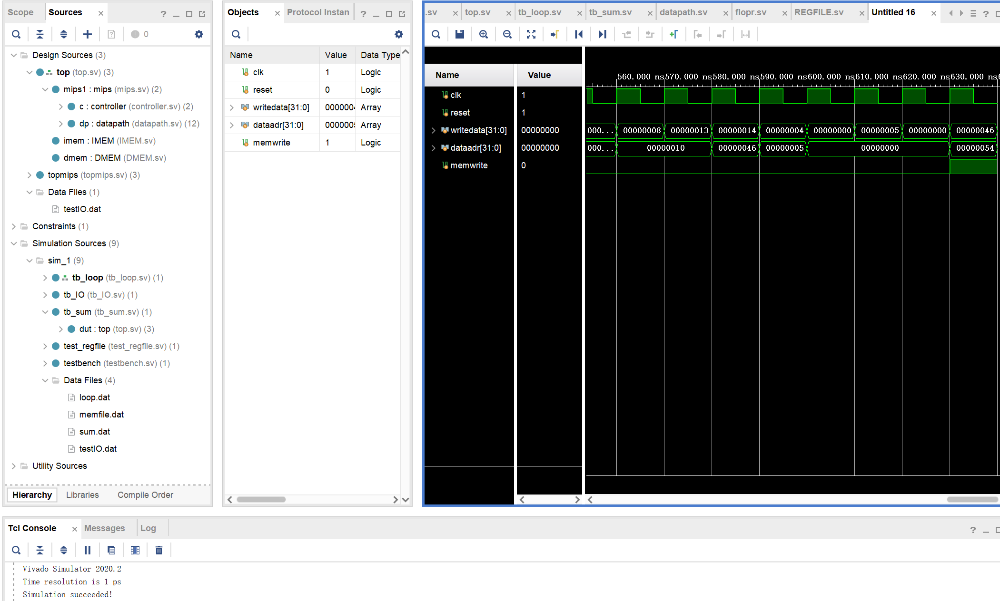
  
### 4.板上验证

* 代码框架
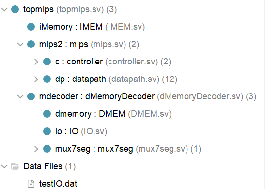
  * dMemoryDecoder: 地址译码器，控制IO，调用原DMEM，将各地址分配到对应的DMEM、IO中，并新增七段数码管译码器`mux7seg`
  * 顶层文件`topmips`加入开发板上的硬件作为输入/输出

* 主要代码
  * `dMemoryDecoder`:

  ```verilog
    assign pread=(addr[7])?1:0;
    assign pwrite=(addr[7])?writeEN:0;
    assign mwrite=(addr[7]==0)?writeEN:0;
    assign readData=(addr[7]==1)?readData2:readData1;
  ```

  根据数据地址（高位）决定数据来自内存还是IO部分

  其余代码在ppt上提及，这里不做赘述

* 运行结果
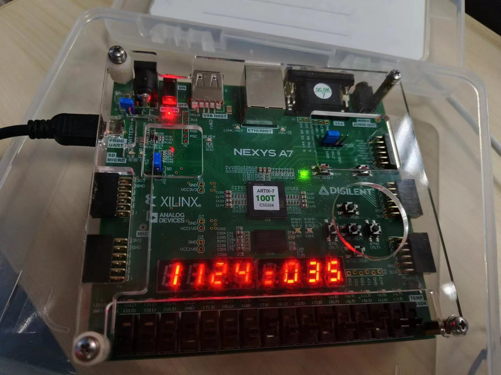

## 实验心得

* 掌握了模拟单周期mips处理器的方法，控制信号与数据路径的处理，并通过增加控制信号的方式扩展指令

* 在vivado寻找bug来源很困难，有时候接口不一致会被优化，从而寻找不到问题出处。因此要养成良好的习惯，在实例化模块的时候需要注意输入输出的顺序，最好按照名称对应，不要偷懒。

* 未解决的问题
  * 我还编写了一个求和`sum.dat`文件，由于时间限制模拟未成功
  * 2.4部分的仿真led始终为0，寻找问题多次无果，但因上板实验成功，猜测不是底层逻辑问题，应是上层仿真文件或者IO逻辑问题

* 进度更新：2024/5/2
  * sum.dat仿真测试
    * 编写了`sum.asm`文件如下

      ```asm
      main:
          # 初始化寄存器
          addi $t0, $zero, 1          # $t0 存储当前要累加的数值
          addi $t1, $zero, 0          # $t1 用于累加和的结果

      loop:
          # 将当前数值累加到结果中
          add $t1, $t1, $t0

          # 增加当前数值
          addi $t0, $t0, 1

          # 检查是否已经计算到10
          slti $t2, $t0, 11       # 11是计算到10
          bne $t2, $zero, loop       # 如果当前数值小于11，则继续循环

          # 存储结果
          sw $t1, 48($zero)
      ```

    * 转为机器码：`sum.dat`

      ```dat
      20080001
      20090000
      01284820
      21080001
      290a000b
      1540fffc
      ac090030
      ```

    * 编写`tb_sum.sv`文件以供测试

      ```verilog
      module tb_sum();

          logic clk;
          logic reset;
          logic [31:0] writedata;
          logic [31:0] dataadr;
          logic memwrite;
        
        
          top dut(clk,reset,writedata,dataadr,memwrite);
          
          initial 
          begin
              reset <= 1; #22; reset <= 0; 
          end
              
        always 
        begin
          clk <= 1;# 5;clk <= 0;# 5;
        end
        
        always@(posedge clk)
          begin 
              if(memwrite) begin
                  if(dataadr === 48 & writedata === 55) begin 
                      $display("Simulation succeeded!");
                      $stop;
                  end

              else if(dataadr !== 48) begin
                      $display("Simulation failed");
                      $stop;
                  end
              end
          end
      endmodule
      ```

    * 测试结果

      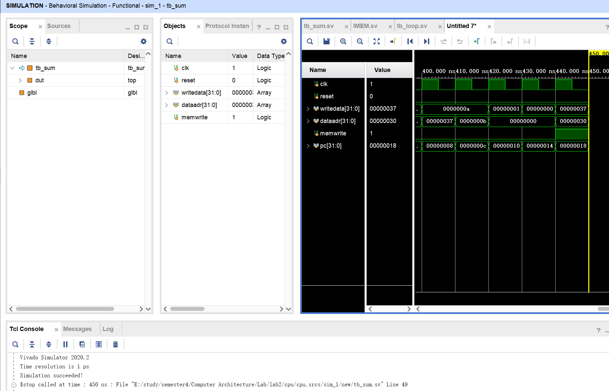

  * `testIO.dat`文件的测试
    * 问题所在：与设想的不同，恰恰是底层逻辑的问题，只不过在之前的测试中可能都恰好规避了这一点。事实上是`alu.sv`文件的逻辑问题，对于`alucont`的case，应使用阻塞赋值。因此代码应该修改为：

      ```verilog
      module ALU(input  logic  [31:0] a,b,
                 input  logic  [2:0] alucont,
                 output logic  [31:0] result,
                 output  logic zero);
                
          always_comb
          case(alucont)
          3'b010:result = a + b;
          3'b110:result = a - b;
          3'b000:result = a & b;
          3'b001:result = a | b;
          3'b111:result = ((a < b) ? 1 : 0);
          endcase
          
          assign zero = result == 0;
      endmodule
      ```
