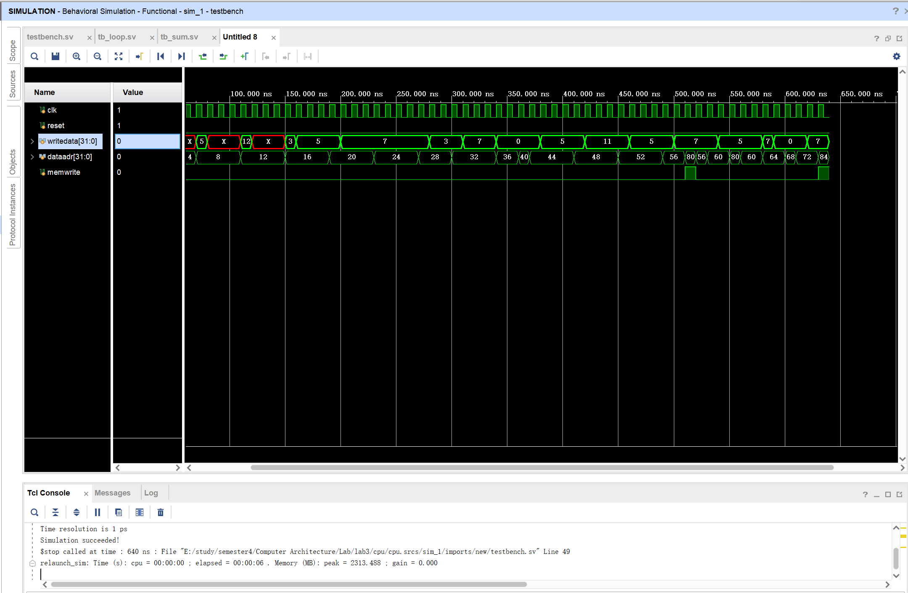

# lab3 多周期MIPS处理器

## 实验目的

* 设计多周期MIPS处理器，包括：
  * 完成多周期MIPS处理器的设计
  * 在Vivado软件进行仿真
  * 编写MIPS代码验证多周期MIPS处理器
  * 在NEXYS4 DDR板上验证

## 实验任务

### 1.设计多周期MIPS处理器

* `ALU.sv`模块的修正
在上一次实验中，ALU使用非阻塞赋值导致后期仿真错误。正确的代码如下

  ```verilog
  module ALU(input  logic  [31:0] a,b,
            input  logic  [2:0] alucont,
            output logic  [31:0] result,
            output logic zero);
            
      always_comb
      case(alucont)
      3'b010:result = a + b;
      3'b110:result = a - b;
      3'b000:result = a & b;
      3'b001:result = a | b;
      3'b111:result = ((a < b) ? 1 : 0);
      endcase
      
      assign zero = result == 0;
  endmodule
  ```

* 底层逻辑大体与单周期一致，这里不作赘述，只说明要大篇幅修改的模块
  * maindec：由简单的选择结构改为有限状态机，每个时钟周期进行状态转移，FSM原理图如下：
  

    主要代码如下：

    ```verilog
    logic [3:0]  state,nextstate;
    logic [17:0] controls;
    
    always_ff @(posedge clk or posedge reset)
        if(reset) state <= FETCH;
        else      state <= nextstate;
        
    always_comb
      case(state)
        FETCH: nextstate = DECODE;    
        DECODE:
            case(op)
                LW:      nextstate = MEMADR;
                //... other op omitted
                default: nextstate = 4'bx;
            endcase
        MEMADR: case(op)
                    LW:    nextstate = MEMRD;
                    SW:    nextstate = MEMMR;
                    default: nextstate = 4'bx;
                endcase
        MEMRD:  nextstate = MEMWB;
        //... other states omitted
        default:nextstate = 4'bx;
      endcase

    assign {pcwrite,memwrite,irwrite,regwrite,alusrca,branchbeq,iord,memtoreg,regdst,alusrcb,pcsrc,aluop,branchbne,immext}=controls;
  
    always_comb
        case(state) 
        // pcwrite,memwrite,irwrite,regwrite_alusrca_branchbeq,iord,memtoreg,regdst_alusrcb_pcsrc_aluop_branchbne,immext

            //irwrite=1 pcwrite=1 iord=0 aluop=+ alusrca=0 alusrcb=01 pcsrc=00
            FETCH  : controls=18'b1010_0_0000_01_00_000_00;   
            // other states omitted
            default: controls=18'b0000_0_0000_00_00_000_00;
        endcase
    ```

  * 增设寄存器IR，DR（使用同一个模块flopenr（带使能）），代码如下：

    ```verilog
    module flopenr #(parameter WIDTH=8)(   
                input logic clk,reset,en,
                input logic [WIDTH-1:0]d,
                output logic [WIDTH-1:0]q
            );

        always_ff@(posedge clk,posedge reset)
            if(reset) q<=0;
            else if(en) q<=d;
    endmodule
    ```

  * 主存合并为一个`MEM`，指令、数据都存储在这里
  * 增加一个四选一复用器模块`MUX4`，以供下一个PC

  * 整体的结构如下：
    
  * `datapath`的结构如下：
    

### 2.仿真

* 导入`testbench.sv`文件，仿真结果如下：
  
  仿真成功！

### 3.验证

使用两个文件进行仿真，对上次单周期未完成的仿真做出了完善与1实现

* tb_loop
  * 程序作用为对一个长度为5的数组求和

    ```mips
    or $8,$0,$0 # $8
    ori $9,$0,9 # $9
    sw $9,0($8)
    addi $8,$8,4
    ori $9,$0,7
    sw $9,0($8)
    addi $8,$8,4
    ori $9,$0,15
    sw $9,0($8)
    addi $8,$8,4
    ori $9,$0,19
    sw $9,0($8)
    addi $8,$8,4
    ori $9,$0,20
    sw $9,0($8)
    ori $10,$0,5 # $t2=5
    or $8,$0,$0 # $t0=0
    # index
    or $9,$0,$0 # $t1=0
    bne $10,S0,loop
    loop:
    slt $11,$9,$10 # if($t1<6) $t3=1
    beq $11,$0,exit
    add $12,$9,$9 #
    add $12,$12,$12 # $t4=4*$t1 018c6020
    lw $13,0($12)
    add $8,$8,$12
    # index++
    addi $9,$9,1
    j loop
    exit:
    sw $8,84($0)
    ```

  * 转为机器码

    ```asm
    00004025
    34090009
    ad090000
    21080004
    34090007
    ad090000
    21080004
    3409000f
    ad090000
    21080004
    34090013
    ad090000
    21080004
    34090014
    ad090000
    340a0005
    00004025
    00004825
    140a0000
    012a582a
    100b0006
    01296020
    018c6020
    8d8d0000
    010d4020
    21290001
    08000013
    ac080054
    ```

  * 运行结果
    * 仿真`tb_loop.sv`文件，预期结果为70。最终测试成功
      

* tb_sum
  * 编写了`sum.asm`文件如下

      ```asm
      main:
          # 初始化寄存器
          addi $t0, $zero, 1          # $t0 存储当前要累加的数值
          addi $t1, $zero, 0          # $t1 用于累加和的结果

      loop:
          # 将当前数值累加到结果中
          add $t1, $t1, $t0

          # 增加当前数值
          addi $t0, $t0, 1

          # 检查是否已经计算到10
          slti $t2, $t0, 11       # 11是计算到10
          bne $t2, $zero, loop    # 如果当前数值小于11，则继续循环

          # 存储结果
          sw $t1, 48($zero)
      ```

  * 转为机器码：`sum.dat`

      ```dat
      20080001
      20090000
      01284820
      21080001
      290a000b
      1540fffc
      ac090030
      ```

  * 编写`tb_sum.sv`文件以供测试
  * 测试结果
    

### 4.板上验证

* `IO.sv`的设计与上次相同，顶层文件与`dMemoryDecoder.sv`也与上次基本一致，结构图如下：
  
* 仿真`tb_IO.sv`，将SW的两个加数设为0x11，0x24，led的期望结果为0x35，结果如下：
  
  符合预期！

* 板上验证
  

## 实验心得

* 掌握多周期处理器的设计，利用有限状态机控制指令执行
* 对vivado上寻找bug有了更深入的认识。通过将出错的数据端口加入仿真视图，自上而下或自下而上的寻找问题来源，同时结合schematic中端口有无接地来判断
* 比较长的仿真在1000ns时就停止了，可以在系统设置仿真时长，也可以调整tb文件的周期长度，这样恰好能体现多周期缩短周期的特点
