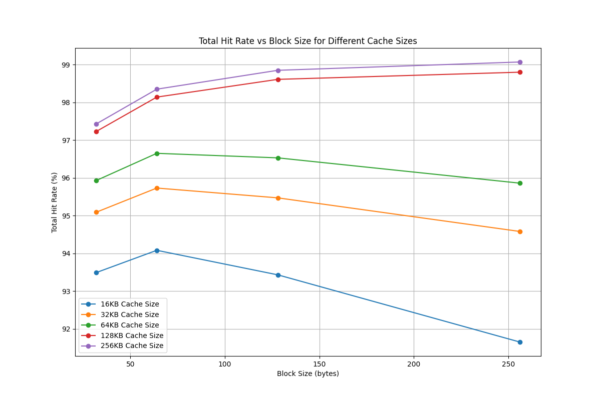
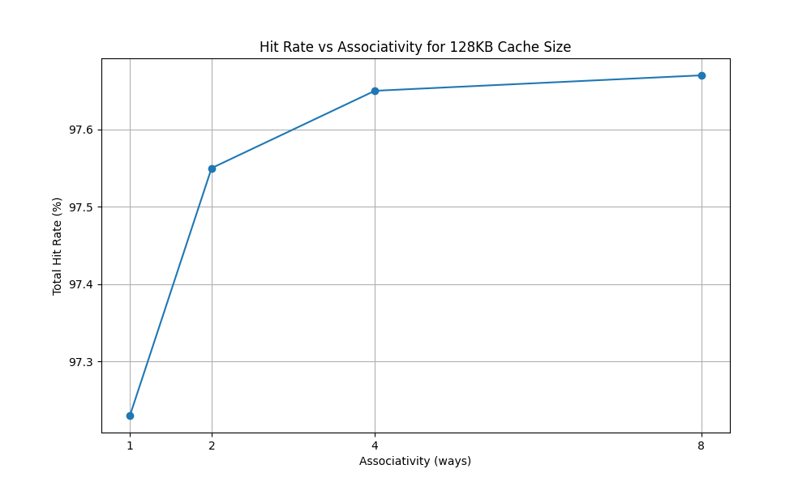
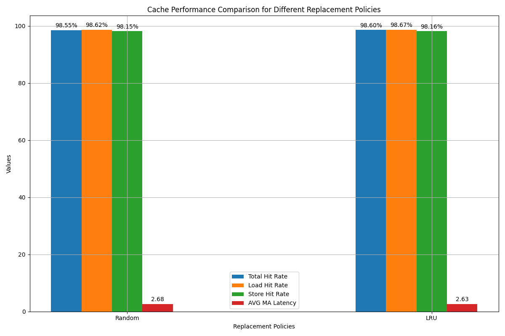
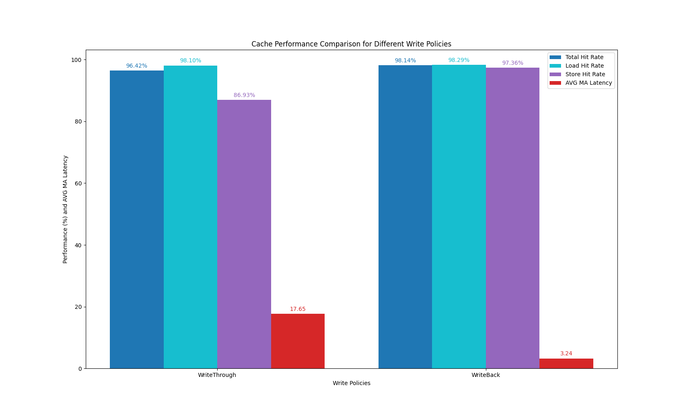

# lab4 构建cache模拟器

## 1.实验目的

* 完成cache模拟器
* 理解cache块大小对cache性能的影响；
* 理解cache关联性对cache性能的影响；
* 理解cache总大小对cache性能的影响；
* 理解cache替换策略对cache性能的影响；
* 理解cache写回策略对cache性能的影响。

## 2.实验内容

### 构建cache模拟器

* 文件架构

  ```markdown
  cache
    -cache.h
    -cache.cpp
    -cachesim.cpp
  ```

* 主要的数据结构/接口

    ```cpp
    struct line
    {
        bool valid; // true: valid
        bool dirty; // true: changed
        long long tag;
        unsigned char *data; // one byte each
        int recently_used;   // count
    };

    class cache
    {
    private:
        int B; // block size
        int E; // associativity
        int S; // number of sets
        line **cache_line;
        int replacement; //replace_policy
        int miss_overhead;
        int write_method; // 0: write through / not write allocate  1: write back / write allocate
        //omitted

    public:
        cache(int, int, int, int, int, int);
        int find_empty(int s);                  // find empty line
        int find_block(long long, int);         // find line with target tag
        int find_LRU(int);                      // find LRU
        int find_replace(int);                  // find the block for replacement
        void update_block(int, int, long long); // update a block
        void run(char, long long, int);         // perform a read/write
        //omitted
    };
    ```

* 运行逻辑/函数调用

  * 每一次访存都通过调用`run()`函数执行
  * 首先，调用`find_block()`函数，寻找缓存中组号为s，标记为为tag的块，若存在返回对应该组中的索引`idx`，否则返回`idx=-1`
  * 根据寻找的情况，分为两类
    * `idx!=-1` 命中+1，根据回写策略计算时间
    * `idx=-1` 代表不命中，首先调用`find_empty`寻找是否有空块，有则填入；否则调用`find_replace()`寻找可替换的块，根据替换策略选择LRU或生成随机数。之后，根据读/写操作以及写分配策略计算miss以及时间。`update_block()`函数用于更新cache块

* 典型的输入输出

  * 在终端输入

    ```bash
    g++ cache.cpp cachesim.cpp -o cachesim
    .\cachesim -c cfg.txt -t ls.trace -o ls.trace.out   
    ```

  * cfg.txt文件如下：

    ```txt
    64
    4
    16
    1
    100
    1
    ```

  * 输出

    ```out
    Total Hit Rate: 97.05%
    Load Hit Rate: 96.99%
    Store Hit Rate: 97.40%
    Total Run Time: 2184514
    AVG MA Latency: 4.48
    ```

### cache配置对性能的影响

* 块大小和cache数据容量大小对命中率的影响

  * 数据大小的影响是易于分析的，cache容量越大，可以存放的数据越多，越容易命中
  * 而块大小的影响是复杂的，一方面，随着块大小变大，具有良好局部性的程序很容易连续命中；另一方面，块大小变大代表着块数量的减少，组数减少，很容易出现映射到同一组的情况，发生冲突，性能下降。
  * 在直接映射、写分配、LRU替换规则下，对于不同的cache大小和块大小，命中率变化如下：
    
  在cache大小在16，32，...，128时，命中率明显地出现“先升后降”，在256KB的情况可能是因为块大小没有达到极值点

* 不同关联性对命中率的影响

  * 不考虑硬件时，关联性的影响是显然的，因为可以充分使用到每一个缓存块
  * cache总容量为128KB，块大小32B，写分配、LRU替换时，不同关联性影响如下：

      

* 替换策略的影响

  * 一般来说，在非直接映射的情况下，LRU优于随机替换
  * 对比如下：
    

* 写策略的影响

  * 写命中时，写直达每次都需要访存，而写回修改脏位为1，在该块之后被替换时统一回写主存，减少访存延迟
  * 不命中时，写回法先将主存块调入（可能需要替换），再进行一次写操作，这样一次miss一次hit，提高了命中率，尽管这是没有意义的提高。
  * 两种方法对比：
    
    可以看到写回的平均访存延迟显著减少，并且写命中率也明显高

## 3.实验心得

对cache的结构与性能有了更深入的理解，建议老师加一些标准测试用于验证正确性（随即替换除外）
