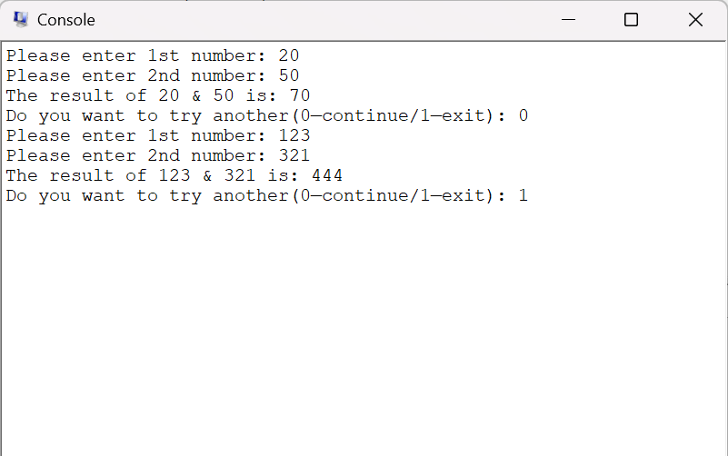
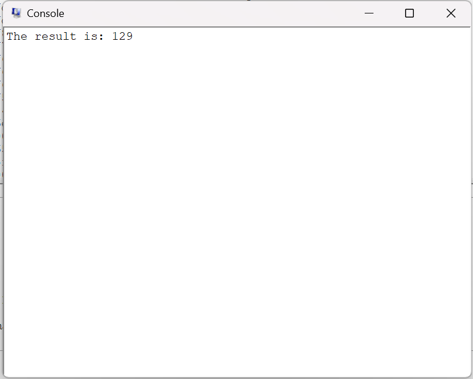
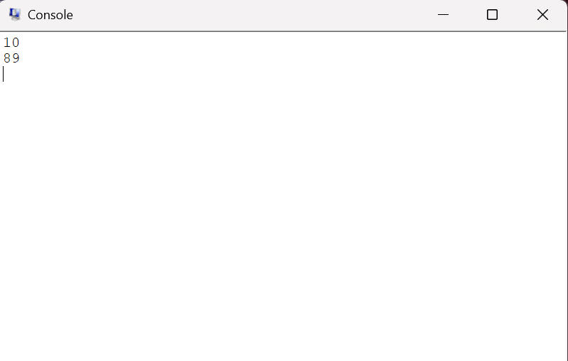

# lab1: MIPS程序设计

## 实验目的

* 熟悉QtSPIM模拟器；
* 熟悉编译器、汇编程序和链接器；
* 熟悉MIPS体系结构的计算，包括
  * MIPS的数据表示；
  * 熟悉MIPS指令格式和寻址方式；
  * 熟悉MIPS汇编语言；
  * 熟悉MIPS的各种机器代码表示，包括
    * 选择结构；
    * 循环结构；
    * **过程调用：调用与返回、栈、调用约定**等；
    * 系统调用。

## 实验过程

### 1. 调试给定程序

#### p1

```mips
main:
    ori $10, $0, 40          ; ori $t2, $0, 40
    # $t2变为40
    
    ori $11, $0, 17          ; ori $t3, $0, 17 
    # $3变为17

    add $11, $10, $11        ; add $t3, $t2, $t3
    # 计算$t2,$3的值之和40+17=57，并赋值给$t3

    ori $0, $0, 40           ; ori $0, $0, 40 
    # 尝试给$0赋值40

    ori $12, $0, 0           ; ori $t4, $0, 0 
    # 并将$0的值赋给$t4，发现$t4的值仍为0，$0也为0

    ori $2, $0, 10           ; ori $v0, $0, 10 
    # $v0变为10

    syscall                  ; syscall 
    # main函数返回

```

运行结果：将两个常数（40，17）保存到两个寄存器中，并计算它们的和为57，保存到寄存器中。过程中尝试修改$0的值，但到下一条指令时，它的值恢复为0

#### p2

```mips
main:
    ori $10, $0, 40          ; ori $t2, $0, 40 
    # $t2变为40

    lui $10, 4660            ; lui $t2, 0x1234 
    # $t2高位两个字节变为 0x1234

    ori $10, $10, 40         ; ori $t2, $t2, 40 
    # $t2与40作或运算，得到0x12340028。结果赋给$t2

    lui $1, 4660             ; li $t3, 0x12340028
    # $at高位两个字节变为 0x1234

    ori $11, $1, 40          ; ori $t3, $at, 40 
    # $at与40作或运算，得到0x12340028。结果赋给$t3

    ori $2, $0, 10           ; li $v0, 10
    # $v0变为10

    syscall                  ; 35: syscall 
    # main函数返回
```

运行结果：将一个32位的立即数（0x12340028）保存到寄存器中，但由于MIPS只能对16位立即数进行操作，因此需要高位和低位分开赋值，这里使用`ori`指令对低位赋值，`lui`指令对高位赋值。在用户原代码段可以发现两次保存立即数选择了不同的指令(ori+lui & li)，但汇编指令是相同的

#### p3

```mips
main:
    lui $1, 4097 [h]
    # 加载h在内存中地址的高位两个字节(0x1001)到$at

    ori $8, $1, 64 [h]
    # 将$at与h在内存中地址低两个字节(0x0040)作或运算，赋值给$t0
    
    #前两个指令即加载h地址(0x100140)到$t0

    lui $9, 4097 [A]         ; la $t1, A 
    # 加载A在内存中的地址到$t1(由于A地址后两个字节都是0，所以只用一步操作)

    lw $10, 0($8)            ; lw $t2, 0($t0) 
    # 加载内存中地址为($t0+0)的值到$t2，即h = 0x28

    lw $11, 32($9)           ; lw $t3, 32($t1) 
    # 加载内存中地址为($t1+32 = 0x10010020)的值到$t3，即A[8] = 0x13

    add $11, $10, $11        ; add $t3, $t2, $t3 
    # 计算h+A[8]，并将结果(=0x3b)保存到$t3

    sw $11, 48($9)           ; sw $t3, 48($t1) 
    # 将$t3的值保存到内存中地址为(0x48+$t1)，即 A[12] = A[8] + h

    ori $2, $0, 10           ; li $v0, 10 
    syscall
    # main函数返回
```

运行结果：data里定义了一个数组A[16]和一个变量h，程序计算A[8]+h，并将结果赋给A[12]

---

### 2.改写程序

需要实现输出输入功能，这里通过修改$v0然后使用syscall指令调用输入输出函数，最后还需实现一个分支，输入0则跳转到main，否则继续向下执行指令，返回。此外需要在内存中定义一些字符串以供输出

主要代码：

```mips
.data
    str1:  .asciiz "Please enter 1st number: " 
    str2:  .asciiz "Please enter 2nd number: " 
    res:  .asciiz "The result of "
    charand:  .asciiz " & "
    is:  .asciiz " is: "
    ques:  .asciiz "Do you want to try another(0—continue/1—exit): "
    newline: .asciiz "\n"


.text   
.globl main

main :    # Program starts at main.
    # print str1
    la     $a0,str1
    li $v0,4
    syscall

    # get num1
    li  $v0,5
    syscall
    or  $t0, $0, $v0  # save num1 to $t0

    # print str2
    la     $a0,str2
    li $v0,4
    syscall

    # get num2
    li  $v0,5
    syscall
    or  $t1, $0, $v0  # save num2 to $t1

    # add two numbers
    add $t2, $t0, $t1 # Register $t2 gets num1+num2

    # print res
    la     $a0,res
    li $v0,4
    syscall

    # print num1
    or     $a0,$0,$t0
    li $v0,1
    syscall

    # print charand
    la     $a0,charand
    li $v0,4
    syscall

    # print num2
    or     $a0,$0,$t1
    li $v0,1
    syscall

    # print is
    la     $a0,is
    li $v0,4
    syscall

    # print sum
    or     $a0,$0,$t2
    li $v0,1
    syscall

    la     $a0,newline
    li $v0,4
    syscall

    # branch

    # print ques
    la     $a0,ques
    li $v0,4
    syscall

    # get ans
    li  $v0,5
    syscall

    # loop if 0
    beq $v0,$zero,main


    ori $v0, $0, 10 # Prepare to exit
    syscall   #   ... Exit.

```

需要注意的是输出字符串和输出数的操作不同（调用的函数不同，以及将数据存到寄存器中的指令也不同）

在Qtsim中运行结果：



---

### 3.C代码翻译为MIPS代码

main函数实现对数组元素求和并输出，过程中需调用sumn函数。

#### 实现思路

* data段
    存一个长度为8的数组以及供结果输出的字符串

    ```mips
    data:
        arr:   .space 32    #未初始化
        res:  .asciiz "The result is: "
    ```

* text 段
  * sumn函数
    * 栈顶指针减32，将返回地址压栈
    * 初始化sum和index为0
    * 设置分支：
      * 若index=N，则不跳转
        * 此时将返回地址出栈，并跳转到返回地址
      * 否则跳转到loop
    * loop：
      * 根据index计算偏移量（=4*index）
      * 取值，累加到sum
      * index+1
      * 跳转到branch进入下一次循环

    ```mips
    sumn:
        # 返回地址压栈
        subu    $sp,$sp,32
        sw       $ra,32($sp)

        # sum=0
        or        $t3,$0,$0
        # index = 0
        or       $t0,$0,$0

    branch:
        # branch if index != N
        bne    $t0,$a1,loop

        # else exit
        or         $v0,$0,$t3
        lw         $ra,32($sp)
        addu     $sp,$sp,32  # 返回地址出栈
        jr          $ra     # 跳转到返回地址


    loop:
        # 计算偏移量
        mul       $t1,$t0,4
        add       $t1,$t1,$a0

        # 取值
        lw          $t2,($t1)

        # 累加
        add        $t3,$t3,$t2

        # index+1
        add        $t0,$t0,1

        j   branch

    ```

  * main函数
    * 数组赋初值
    * 传参，调用sumn函数
    * 输出sumn函数的返回值
    * 退出

    ```mips

    main:           # Program starts at main.

        # 数组赋初值
        #array[0]
        or          $t0,$0,$0
        ori         $t1,$0,9
        sw          $t1,arr($t0)

        # array[1]
        addu      $t0,$t0,4
        ori         $t1,$0,7
        sw          $t1,arr($t0)

        # array[2]
        addu      $t0,$t0,4
        ori         $t1,$0,15
        sw          $t1,arr($t0)

        # array[3]
        addu      $t0,$t0,4
        ori         $t1,$0,19
        sw          $t1,arr($t0)

        # array[4]
        addu      $t0,$t0,4
        ori         $t1,$0,20
        sw          $t1,arr($t0)

        # array[5]
        addu      $t0,$t0,4
        ori         $t1,$0,30
        sw          $t1,arr($t0)
        
        # array[6]
        addu      $t0,$t0,4
        ori         $t1,$0,11
        sw          $t1,arr($t0)

        # array[7]
        addu      $t0,$t0,4
        ori         $t1,$0,18
        sw          $t1,arr($t0)

        # N=8
        ori         $t2,$0,8

        # 传参
        la          $a0,arr
        or         $a1,$0,$t2

        # 调用sumn
        jal         sumn

        # 存储返回值
        or         $s0,$0,$v0

        # 打印结果
        li          $v0,4
        la         $a0,res
        syscall
        
        li          $v0,1
        or        $a0,$0,$s0
        syscall

        # 返回
        li          $v0,10
        syscall
    ```

#### 运行结果



### 4.代码优化

#### 优化思路
  
* fib-o.asm两次调用fib函数，因此需要用栈保存fib(n-1)的结果、参数n（向栈存和读各需一条指令），且计算fib(n)的调用次数约为O(fib(n))，分析发现计算fib(n-1)的过程已经计算了fib(n-2)，那么可以计算fib(n-1)后保留fib(n-2)的结果。

* 因此可以让fib函数返回$fib_n$和$fib_{n-1}$两个数，即将第二个返回值保存到$$v1$寄存器。而$fib_n$为fib(n-1)的两个返回值之和

* 这样每次只需一次递归就能计算出结果，总的调用次数为n，并且无需用栈保存n和$fib_{n-1}$

#### 主要代码

```mips
fib:
    bgt $a0, 1, fib_recurse # if n < 2, then just return a 1,
    li $v0, 1 # don’t build a stack frame.
    li $v1, 1
    jr $ra
    # otherwise, set things up to handle

fib_recurse: # the recursive case:
    subu $sp, $sp, 32 # frame size = 32, just because...
    sw $ra, 28($sp) # preserve the Return Address.
    sw $fp, 24($sp) # preserve the Frame Pointer.
    addu $fp, $sp, 32 # move Frame Pointer to new base.

    # compute fib (n - 1):
    sub $a0, $a0, 1 # compute fib (n - 1)
    jal fib

    add $v0, $v0, $v1 # $v0 = fib (n - 1) + fib (n - 2)
    sub $v1, $v0, $v1 # $v1 = fib (n - 1)
    lw $ra, 28($sp) # restore Return Address.
    lw $fp, 24($sp) # restore Frame Pointer.
    addu $sp, $sp, 32 # restore Stack Pointer.
    jr $ra          # return.
```

#### 运行结果


## 实验总结

* 掌握了简单的MIPS程序设计
* 对过程调用有了更深入的理解，能够从底层分析函数的优化思路
* 未解决的问题：参考教材上说可以通过命令行运行.asm文件，并显示运行时间，这样可以更好的分析代码优化程度，但我不知道如何使用