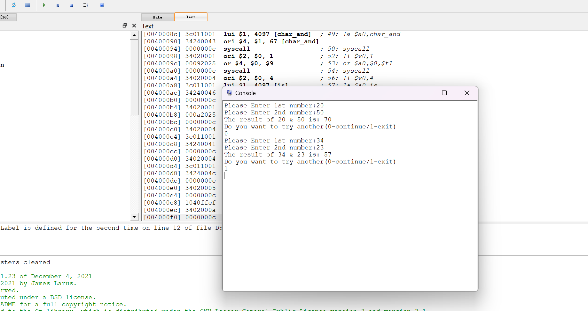
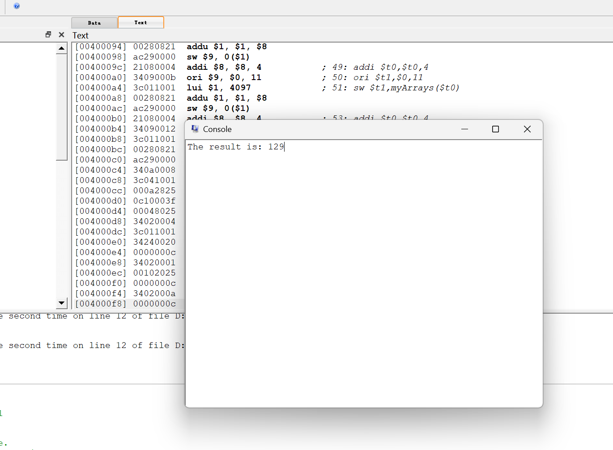

# 实验1：MIPS程序设计
  *实验时间：2.18-3.17*
  ## 1 实验目的
  - 熟悉QtSPIM模拟器；
  - 熟悉编译器、汇编程序和链接器；
  - 熟悉MIPS体系结构的计算，包括
    - MIPS的数据表示；
    - 熟悉MIPS指令格式和寻址方式；
    - 熟悉MIPS汇编语言；
    - 熟悉MIPS的各种机器代码表示，包括
      - 选择结构；
      - 循环结构；
      - **过程调用：调用与返回、栈、调用约定**等；
      - 系统调用。
    其中加粗的部分要特别注意掌握。
  ## 2 实验过程
### 调试程序
  #### p1
  从main标签处开始运行
  下为每一条语句的运行结果：
  ```
  main:				# Program starts at main.
    ori	$t2, $0, 40	
    # $t2的值变为40

	  ori	$t3, $0, 17	
    # $t3的值变为17

	  add	$t3, $t2, $t3	
    # $t3的值变为40+17=57

	  ori	$0, $0, 40	
    # $0的值变为40

	  ori	$t4, $0, 0	# ... but it really doesn't
    # $0的值变回0，$t4的值也仍保持为0

    
	  ori	$v0, $0, 10	
	  syscall			
    # main函数 return
  ```
  运行结果：先给`$t2`,`$t3`两个寄存器赋值，再将值相加，结果存储到`$t3`
  并且，若给`$0`赋不为0的值，只会短暂地使`$0`的值不为0，下一条指令时`$0`会自动复原
  #### P2
  从main标签处开始运行
  下为每一条语句的运行结果：
  ```
  main:				
        ori	$t2, $0, 40	
        # $t2的值变为40

	lui	$t2, 0x1234	
        # $t2的值变为0x12340000        
        ori	$t2, $t2, 40	
        # $t2的值变为0x12340028

	li	$t3, 0x12340028 
        # t3的值变为0x12340028

	li	$v0, 10		
	syscall			
  # 函数返回
  ```
  运行结果：这个程序列举了给寄存器赋值的三种方法：
   1. ori 以`$0`基准，使目标寄存器 =0|x即x

    但因为立即数只占16bit，所以最大不超过0x7fff，如果大于这个值，就不能只用ori赋值
   2. lui，ori

    高位和低位分开赋值，lui可以将一个16位立即数传入寄存器高16位，ori可以传入低16位，这样可以完整赋值
   3. li

    直接用寄存器和32位立即数赋值

#### P3

  data中声明了一个数组和一个占1个字的整型变量
  main中运行结果：
  ```
    main:                          
        la      $t0, h          
        # $t0 的值变为 0x10010000，是h在内存中的地址
      
        la      $t1, A          
        # $t1 的值变为 0x10010040,是A的第一个元素在内存中的地址

        lw      $t2, 0($t0)     
        # $t2 的值变为40，即h的值

        lw      $t3, 32($t1)    
        # $t3 的值变为19，即A[8]的值

        add     $t3, $t2, $t3   
        # $t3 的值变为40+19=59
        
        sw      $t3, 48($t1)    
        # 内存中A[12] 的值变为59

        li      $v0, 10         
        syscall                 
        # 函数返回
  ```
  运行结果：
  该程序展现了对内存中变量的获取和赋值方法，可以直接用label名赋值给寄存器，得到其地址，对`4*i(该地址)`用lw可以访问到下标为i的元素。
  同理，对`4*i(该地址)`用sw可以给下标为i的数组元素赋值。


### 改写程序
##### 设计过程
做加法的部分参照p1的代码，在p1的基础上添加输入和输出语句。
另外，在程序结束前输出询问是否进行再来一次，若是就跳转到主函数

##### 输入输出
输入与输出都采用mips提供的方法，给`$v0`赋值，然后syscall
##### 核心代码
在.data中存储需要被打印的字符串或者字符
在.text中书写程序正文

```
.data
    hint1:    .asciiz "Please Enter 1st number:"
    hint2:    .asciiz "Please Enter 2nd number:"
    result:   .asciiz "The result of "
    newline:	.asciiz "\n"
    char_and: .byte '&'
    space:		.asciiz  " "
    is:       .asciiz " is: "
    another:  .asciiz "Do you want to try another(0-continue/1-exit)\n"

.text
    main:
      # get the 1st number
        # print hint1
        li $v0,4
        la $a0,hint1
        syscall

        # get input
        li $v0,5
        syscall
        or	$t0, $0, $v0	# Register $t0 gets the 1st value

      # ...相同方式得到第二个数 并存在$t1中

        # add $t0,$t1
        add $t2,$t0,$t1

		# print result
        # 打印提示语句；
        li $v0,4
        la $a0,result
        syscall

        # print 1st number
        li $v0,1
        or $a0, $0, $t0
        syscall

        li $v0,4
        la $a0,space
        syscall

        # '&'
        li $v0,4
        la $a0,char_and
        syscall

        # print 2nd number
        li $v0,1
        or $a0, $0, $t1
        syscall

        li $v0,4
        la $a0,is
        syscall

        # print result
        li $v0,1
        or $a0, $0, $t2
        syscall

        li $v0,4
        la $a0,newline
        syscall

      # branch   
        li $v0,4
        la $a0,another
        syscall

        li $v0,5
        syscall
        
        # 是0就跳转
        beq $v0,$zero,main

        li $v0,10
        syscall

```
在qtspim中运行结果如图：

与示例一致
### C代码编译
#### 设计过程
分析该程序，首先在main中，将数组的初值store到对应内存中，并给n赋值
然后按顺序将函数参数赋给`$a0`,`$a1`,jal跳到对应函数sumn
在sumn中首先初始化sum,idx这两个值，然后跳到循环。在循环中首先判定idx是否满足要求，不满足则跳到exit，exit中将sum值赋给`$v0` (函数返回值),按ra中存储地址返回
若满足继续循环，从数组中取值：基于`$a0` 偏移 idx*4个，所以先乘后加，最后lw到寄存器t4中，t4累加到sum上。操作完成后idx自加，回到循环j loop。

按照分析情况，代码如下:
#### 输入输出 
只用输出最后的提示语句"The result is: "和运算的结果
#### 核心代码
```
.data 
	myArrays:	.space 32
	result:		.asciiz "The result is: "
.text
main:
	# 数组赋初值
	# $t0:index,每次加4，便于寻址
	or $t0,$0,$0
    ori $t1,$0,9
    sw  $t1,myArrays($t0)
    
    addi $t0,$t0,4
    ori $t1,$0,7
    sw  $t1,myArrays($t0)
    
    ...
    # 用上述方法初始化数组
    
    # N=8
    ori $t2,$0,8
    
    # 把两个函数参数放在$a0,$a1中
    la $a0,myArrays
    or $a1,$0,$t2
    # 调用函数sumn
    jal sumn
    
    # 存储返回值
    or $s0,$0,$v0
    
    # 打印result
    li $v0,4
    la $a0,result
    syscall
    
    # 打印计算结果
    li $v0,1
    or $a0,$0,$s0
   	syscall
    
    #end
     li $v0,10
     syscall
    
sumn:
	# 开栈
	subu $sp,$sp,32
	sw $ra, 28($sp) 
	sw $fp, 24($sp) 
	addu $fp, $sp, 32 

	# sum=0
	or $t0,$0,$0
	# index
	or $t1,$0,$0
	j loop
loop:
	# index>=N 就退出
	slt $t2,$t1,$a1   	
	beq $t2,0,exit
	
	# 计算偏移值
	mul $t3,$t1,4
	add $s0,$a0,$t3
	# 从数组中取值
	lw 	$t4,($s0)
	# 累加
	add $t0,$t0,$t4
	
	# index++
	addi $t1,$t1,1
	
	j loop
	 
exit:
    or $v0,$0,$t0
    # return 
 	lw $ra, 28($sp) 
	lw $fp, 24($sp) 
	addu $sp, $sp, 32 
	jr $ra
```
在qtspim中运行结果如图：
  
129：答案正确！

### 代码优化
#### 设计过程：
优化思路是将函数调用改为循环，结果存储到数组中，即采用动态规划，fib[i]=fib[i-1]+fib[i-2]
但是由于这个数组的值是由输入的n决定的，因此不能直接在data中声明一个固定大小的空间。
所以想到，用`$sp`的变化在栈上开辟大小为`4*(n+1)`的空间，对这段空间采取类似数组一样的存储和调用方法。这是可行的，因为栈和数组都保存在主存中。
这样会提高速度：
一是省去了多次函数调用开栈销栈的时间花费，
二是保证每个值只被计算一次，递归函数中基本每个值会被重复计算两次，没有有效的方法记录下过去计算的值。而用动态规划数组就可以保证每个值只被计算一次，这里可以节省大约一半的时间。

下为具体思路：
  首先打印信息，得到N值，将N+1，先判定不开“数组”的情况，n==1时，直接打印1并返回。
  若不为1，开辟栈空间，将`$sp`下移`4*(n+1)`,并赋初值fib[0]=0,fib[1]=1
  接下来设置好index初值2，开始循环。
  当index>=(n+1) 退出并打印结果，不要忘记将`$sp`加回去，复原栈空间。
  在循环内部，首先取出fib[i-1]，地址`$t4=4(index-1)+$sp`,取出暂存在`$s0`中，然后将`$t4`-4得到fib[i-2]的地址，lw到`$s1`中，令`$s2=$s1+$s0`，存到`$t4+8`对应地址中(即fib[i])。
  因为退出循环的时候最后一次的结果就在`$s2`中，所以打印时可以直接将`$s2`的值赋给`$a0`，不用再从数组中sw。

#### 输入输出 
输出计算的结果 提示语句"Fib[n]="，和最后的结果

#### 核心代码
```
.data
	messageInput: .asciiz "Input n:"
	messageOutput: .asciiz "Fib[n]="
.text
	main:
  # 打印提示语句
  # 输入的n 存在$v0中
  ...

	# n
	# t0=n+1
	addi $t0,$v0,1
	
	# 一个数占4个byte
	# 开栈，模拟有数组 
	mul	$t1,$t0,4
	subu $sp,$sp,$t1
	
	# fib[0]=0
	# fib[1]=1
	sw	$0,0($sp)
	addi $t2,$0,1
	sw	$t2,4($sp)

	# if(n==1)
	# return
	beq	$t0,2,end
	
  # 依据以下代码书写mips语句
	# for(int i=2;i<=n;i++)
	# {
	# 	fib[i]=fib[i-1]+fib[i-2]
	# }
	
	# index:	t2
	addi $t2,$0,2
	j loop
  
loop:
	
	# if(!(index<i+1)) break
	slt $t3,$t2,$t0
	beq $t3,0,exit
	
	# 循环内部：
  # 寻址 找到fib[i-1]的地址
	# $t4=$t2-1
	subi $t4,$t2,1
	# t4=t4*4
	mul $t4,$t4,4
	# t4=$t4+$sp
	add $t4,$t4,$sp

	# S0=fib[i-1]
	lw $s0,($t4)
	
	# s1=fib[i-2]
	subi $t4,$t4,4
	lw $s1,($t4)
	
  # 相加并赋给fib[i]
	addi $t4,$t4,8
	add $s2,$s0,$s1
	sw	$s2,($t4)
	
	# index++
	addi $t2,$t2,1
	j loop
	
	# when n==1:
	end:
	
  # 打印fib[n] = 1 并退出
  ...
	
	exit:
	
  # 打印fib[n] = $s2
  ... 

  # 栈空间复原
	addu $sp,$sp,$t1
	
	li $v0,10
	syscall
	
```
运行截图：
fib[1]=1


正确！

## 4 实验感想
   ### 收获
   对MIPS赋值、寻址方式，常见运算和基本结构有了一定了解，着重掌握了函数的过程调用，对栈空间的处理，有很多收获
   ### 问题和解决办法
   - Qtspim不会用：

    解决方法：
      1. 探索出了更好用的mips编辑器：mars，在mars上书写代码，qtspim只做调试作用
      2. 多次尝试后研究出了使用方法，在传入新文件前需要初始化编辑器。不方便打断点就单步运行，也能有不错的结果。
   - 不了解语法，书写代码遇到困难

    书上对机器码的结构做了具体阐述，mips代码的书写确泛泛，看完之后依旧有些无从下手
    解决：在b站上找到mips的视频教程，学会了基本文件结构和简单语句的书写，再看书也轻松很多。

### 建议
实验描述可以更具体一点，比如第一个任务调试程序并记录结果，因为是没有输入输出的程序，会有点费解具体要什么运行结果。
