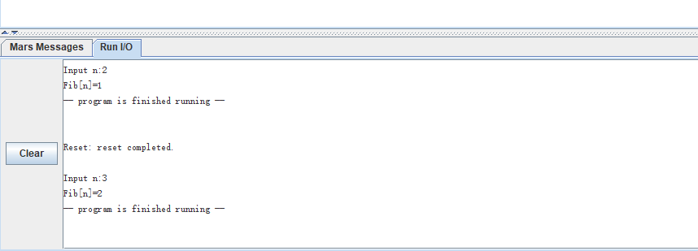
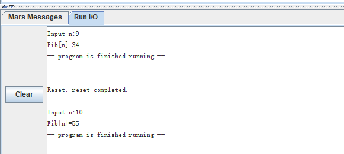

#  实验1：MIPS程序设计

##  调试程序

  ### p1
  从main标签处开始运行
  下为每一条语句的运行结果：
  ```
  main:				# Program starts at main.
    ori	$t2, $0, 40	
    # $t2的值变为40
  
	  ori	$t3, $0, 17	
    # $t3的值变为17
  
	  add	$t3, $t2, $t3	
    # $t3的值变为40+17=57
  
	  ori	$0, $0, 40	
    # $0的值变为40
  
	  ori	$t4, $0, 0	# ... but it really doesn't
    # $0的值变回0，$t4的值也仍保持为0
  
  
	  ori	$v0, $0, 10	
	  syscall			
    # main函数 return
  ```
  运行结果：先给`t3`两个寄存器赋值，再将值相加，结果存储到`0`赋不为0的值，只会短暂地使`0`会自动复原
  ### P2
  从main标签处开始运行
  下为每一条语句的运行结果：
  ```
  main:				
        ori	$t2, $0, 40	
        # $t2的值变为40
  
	lui	$t2, 0x1234	
        # $t2的值变为0x12340000        
        ori	$t2, $t2, 40	
        # $t2的值变为0x12340028
  
	li	$t3, 0x12340028 
        # t3的值变为0x12340028
  
	li	$v0, 10		
	syscall			
  # 函数返回
  ```
  运行结果：这个程序列举了给寄存器赋值的三种方法：
   1. ori 以`t0, h          
        # t1, A          
        # t2, 0(t2 的值变为40，即h的值

        lw      t1)    
        # t3, t3   
        # t3, 48(v0, 10         
        syscall                 
        # 函数返回
  ```
  运行结果：
  该程序展现了对内存中变量的获取和赋值方法，可以直接用label名赋值给寄存器，得到其地址，对`4*i(该地址)`用lw可以访问到下标为i的元素。
  同理，对`4*i(该地址)`用sw可以给下标为i的数组元素赋值。
  
  
##  改写程序
  
在.data中存储需要被打印的字符串或者字符
在.text中书写程序正文
  
  ```
.data
    hint1:    .asciiz "Please Enter 1st number:"
    hint2:    .asciiz "Please Enter 2nd number:"
    result:   .asciiz "The result of "
    newline:	.asciiz "\n"
    char_and: .byte '&'
    space:		.asciiz  " "
    is:       .asciiz " is: "
    another:  .asciiz "Do you want to try another(0-continue/1-exit)\n"

.text
    main:
      # get the 1st number
        # print hint1
        li a0,hint1
        syscall

        # get input
        li t0, v0	# Register v0,4
        la v0,5
        syscall
        or	0, t1 gets the 2nd value

        # add t1
        add t0,v0,4
        la v0,1
        or 0, v0,4
        la v0,4
        la v0,1
        or 0, v0,4
        la v0,1
        or 0, v0,4
        la v0,4
        la v0,5
        syscall

        beq zero,main
      
        li a0`,`v0` (函数返回值),按ra中存储地址返回
若满足继续循环，从数组中取值：基于`t0:index,每次加4，便于寻址
	or 0,t1,t1,myArrays(t0,t1,t1,myArrays(t0,t1,t1,myArrays(t0,t1,t1,myArrays(t0,t1,t1,myArrays(t0,t1,t1,myArrays(t0,t1,t1,myArrays(t0,t1,t1,myArrays(t2,a0,a0,myArrays
    or 0,s0,v0
  
    # 打印result
    li a0,result
    syscall
  
    # 打印计算结果
    li a0,s0
   	syscall
  
    #end
     li sp,ra, 28(fp, 24(fp, t0,0
	# index
	or 0,t2,a1   	
	beq t3,s0,t3
	# 从数组中取值
	lw 	s0)
	# 累加
	add t0,t1,v0,t0
    # return 
 	lw sp) 
	lw sp) 
	addu sp, 32 
	jr sp`的变化在栈上开辟大小为`4*(n+1)`的空间，对这段空间采取类似数组一样的存储和调用方法。这是可行的，因为栈和数组都保存在主存中。
这样会提高速度：
一是省去了多次函数调用开栈销栈的时间花费，
二是保证每个值只被计算一次，递归函数中基本每个值会被重复计算两次，没有有效的方法记录下过去计算的值。而用动态规划数组就可以保证每个值只被计算一次，这里可以节省大约一半的时间。

下为具体思路：
  首先打印信息，得到N值，将N+1，先判定不开“数组”的情况，n==1时，直接打印1并返回。
  若不为1，开辟栈空间，将`sp`加回去，复原栈空间。
  在循环内部，首先取出fib[i-1]，地址`sp`,取出暂存在`t4`-4得到fib[i-2]的地址，lw到`s2=s0`，存到`s2`中，所以打印时可以直接将`a0`，不用再从数组中sw。

  下为具体代码:

```
.data
	messageInput: .asciiz "Input n:"
	messageOutput: .asciiz "Fib[n]="
.text
	main:
		# print the messageInput
  
	li $v0,4
	la $a0,messageInput
	syscall
  
	li $v0,5
	syscall
  
	# n
	# t0=n+1
	addi $t0,$v0,1
  
	# 一个数占4个byte
	# 开栈，模拟有数组
  
	mul	$t1,$t0,4
	subu $sp,$sp,$t1
  
	# fib[0]=0
	# fib[1]=1
	sw	$0,0($sp)
	addi $t2,$0,1
	sw	$t2,4($sp)
  
	# if(n==1)
	# return
	beq	$t0,2,end
  
	# for(int i=2;i<=n;i++)
	# {
	# 	fib[i]=fib[i-1]+fib[i-2]
	# }
  
	# index:	t2
	addi $t2,$0,2
	j loop
loop:
  
	# if(!(index<i+1)) break
	slt $t3,$t2,$t0
	beq $t3,0,exit
  
	# 循环内部：
	# $t4=$t2-1
	subi $t4,$t2,1
	# t4=t4*4
	mul $t4,$t4,4
	# t4=$t4+$sp
	add $t4,$t4,$sp
	# S0=fib[i-1]
	lw $s0,($t4)
  
	# ss1=fib[i-2]
	subi $t4,$t4,4
	lw $s1,($t4)
  
	addi $t4,$t4,8
	add $s2,$s0,$s1
	sw	$s2,($t4)
  
	# index++
	addi $t2,$t2,1
	j loop
  
	# when n==1:
	end:
  
	li $v0,4
	la $a0,messageOutput
	syscall
  
	li $v0,1
	or $a0,$0,1
	syscall
  
	li $v0,10
	syscall
  
	exit:
  
	li $v0,4
	la $a0,messageOutput
	syscall
  
	li $v0,1
	or $a0,$0,$s2
	syscall
  
  # 栈空间复原
	addu $sp,$sp,$t1
  
	li $v0,10
	syscall
  
```
运行截图：
fib[1]=1


正确！