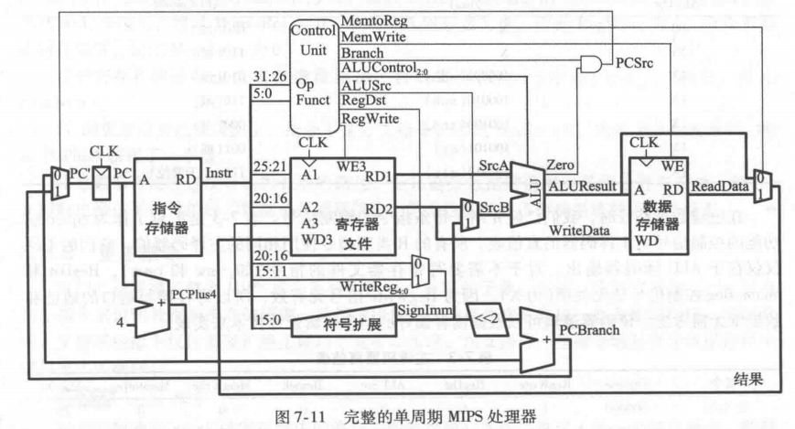
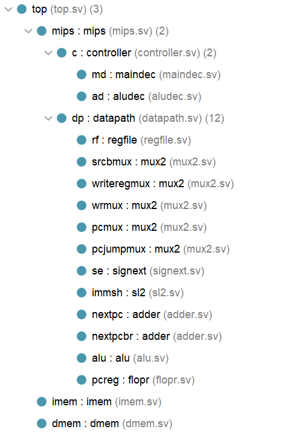
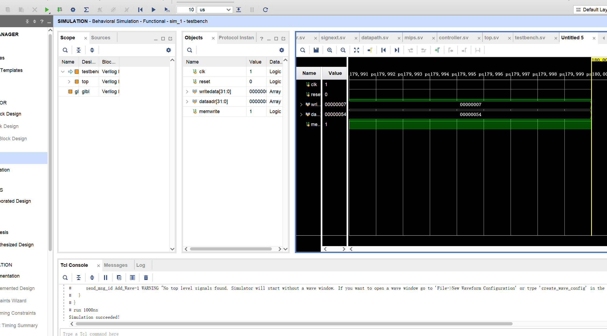
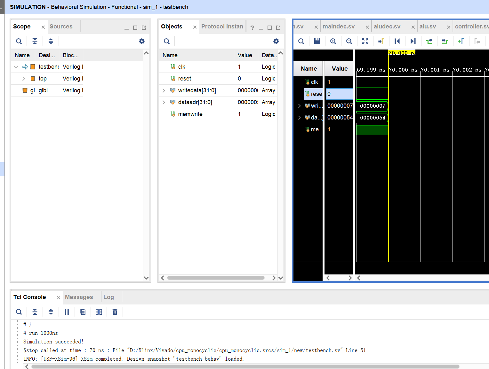
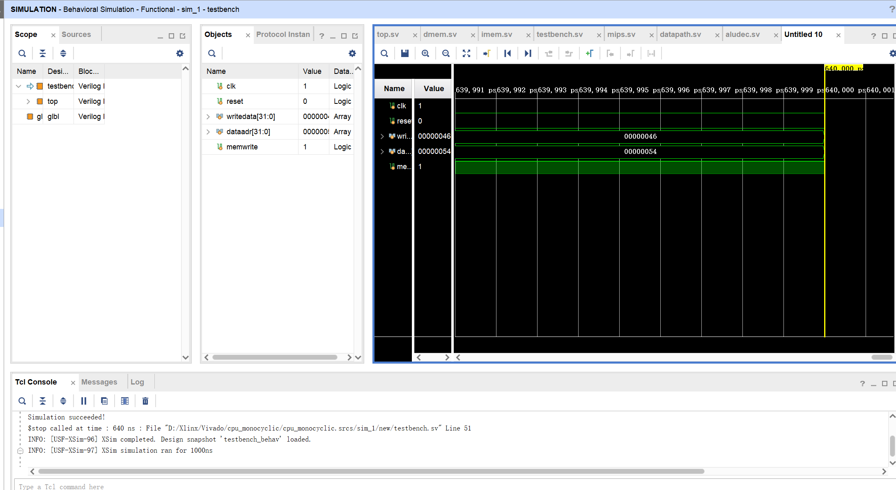
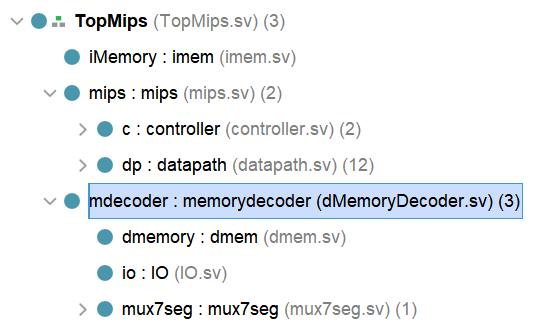
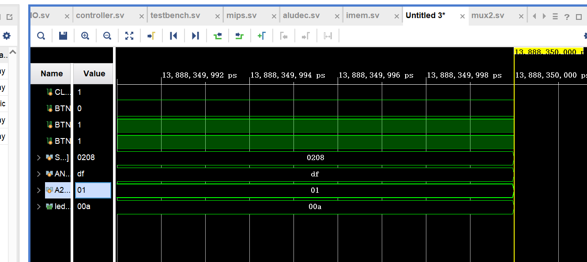
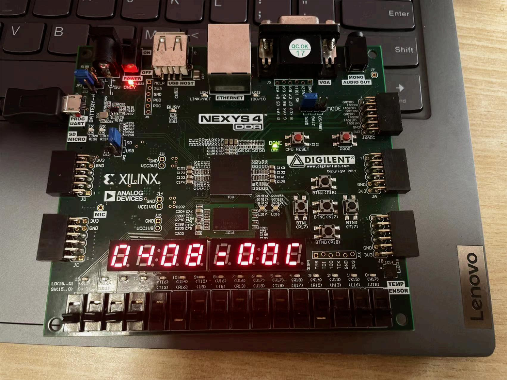
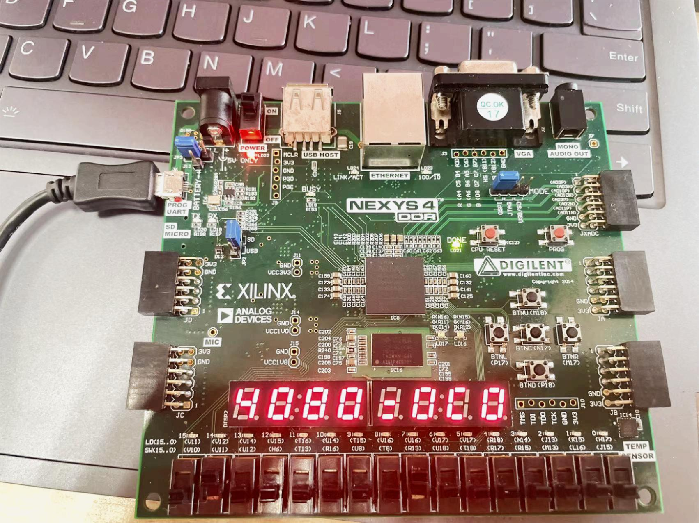

# 实验二：单周期mips处理器

*实验时间：2023.3.29*

[TOC]

## 1 实验目的

实验目的：
- 熟悉Vivado软件；
- 熟悉在Vivado软件下进行硬件设计的流程；
  - 设计单周期MIPS处理器，包括
  - 完成单周期MIPS处理器的设计；
  - 在Vivado软件上进行仿真；
  - 编写MIPS代码验证单周期MIPS处理器；
  - 在NEXYS4 DDR板上进行验证
## 2 实验过程
### 2.1 设计单周期MIPS处理器
#### 设计方案
  由于核心代码已经在书中给出，在本报告中将简略分析各模块的作用，重点放在拓展几条指令的部分上。
##### 分析代码
     

  根据上图搭建好代码框架。
    文件架构如图：
     

  - `controller`:
    分析处理op，根据op分配各个控制信号的值(maindec)，以及alu所做的运算方式(aludec)，r类型指令所作运算由funct指定，但非r类型没有funct，所以aludec的输入除了funct，还有从maindec输出的aluop，针对非r类型指令，根据指令类型指定运算方式
  - `datapath`:
      - `alu` alu模块，输入两个操作数，输出结果和zeroflag，主要是用于beq判定是否跳转（拓展指令后也用于判定bne是否跳转）
      - `mux2` 二选一复用器，由于有时选地址（5位数组），有时选32位数组，所以用#(parameter WIDTH=8),实例化时可传常数，提高代码的复用率
      - `regfile` 寄存器文件，输入两个五位读地址，输出两个三十二位读数据，输入一个写使能，一个写数据，一个写地址。当写使能为1时，写入数据。
      - `signext` 符号扩展，立即数只有十六位，但alu或者adder源操作数是32位数组，所以做符号扩展
      - `sl2` 左移2位，即乘4，主要是寻址时将label的字节地址转化成字地址，需要乘4
      - `adder` 32位加法器
      - `flopr` 触发器，异步赋值或者reset 

  **一条指令的运行方式**为：根据pc的值从`imem`中读取指令，存储到op中，在`controller`这一模块中分析处理op，根据op分配各个控制信号的值，以及alu所做的运算方式。
`controller`分配的控制信号控制`datapath`中各个复用器值的选取，先访问寄存器文件，读取两个寄存器的值，来到`alu`，由复用器选择此时第二个操作数来自寄存器还是内存。运算结果来到`dmem`由写使能控制是否写入。同时zero和branch的值共同决定是否跳转，若跳转$pc'=pc+4+(imm<<2)$，否则$pc'=pc+4$,在触发器中更新pc的值，运行结束。

##### 拓展指令

对指令集的扩展主要集中于`controller`模块中

- `maindec`

原本controls赋值为

```verilog
assign { regwrite,regdst,alusrc,branch,memwrite,memtoreg,jump,aluop } = controls;
```

只有branch，无法满足beq和bne，所以拆分成branchbeq和branchbne，共同决定是否跳转

​	`controller`中控制信号也改为：

```verilog
assign pcsrc = (branchbeq & zero)|(branchbne & (!zero));
```

aluop原本只需要满足加、减、根据funct决定运算方式，所以两位数组就可以满足编码要求

现在由于扩展指令集加入andi，ori，slti这些指令，原本的两位编码不够，扩展至三位编码

000:+	001:-	010:and	011:or	100:funct	101: slt

所以controls改为：

```verilog
assign { regwrite,regdst,alusrc,branchbeq,branchbne,memwrite,memtoreg,jump,aluop } = controls;
```

- `aludec`

  根据修改的aluop分配alucontrol的值

  且由于需要扩展指令nop，需要给funct为000000的情况赋值，可以随便赋一个存在的运算方式的编码，因为此时可以看作向地址编号为0的目的寄存器写入值，而这不会产生任何影响。

#### 核心代码

##### `controller`根据op分配控制信号：

 ```verilog
     assign { regwrite,regdst,alusrc,branchbeq,branchbne,memwrite,memtoreg,jump,aluop } = controls;
    
     // regwrite： 写入寄存器
     // regdst：指明目的寄存器是哪一个  0是i类型 1是第r类型 
     // alusrc : alu中第二个操作数来自reg还是立即数 0：寄存器 1：立即数
     // branch：也是控制选择器 若为1 就选择pc+4+branchlabel*4 若为0 就pc+4
     // memwrite 写入内存使能
     // memtoreg 因为写入寄存器的值可能来自两个地方：alu的结果0 或者从内存中读到的结果1 memtoreg也是选择器控制单元
     // j指令
     // 扩展前：aluop: 00:+ 01:- 10:看funct 11:undefined
     // 扩展后：aluop"三位编码 000:+ 001:- 010:and 011:or 100:funct 101:slti 110,111:undefined
    
     always_comb
     case(op)
         6'b000000:controls <= 11'b110_00_00_0_100; //r
         6'b100011:controls <= 11'b101_00_01_0_000; //lw
         6'b101011:controls <= 11'b001_00_10_0_000; //sw
         6'b000100:controls <= 11'b000_10_00_0_001; //beq   
         6'b000101:controls <= 11'b000_01_00_0_001; //bne
         6'b001000:controls <= 11'b101_00_00_0_000; //addi 001000
         6'b001100:controls <= 11'b101_00_00_0_010; //andi
         6'b001101:controls <= 11'b101_00_00_0_011; //ori
         6'b001010:controls <= 11'b101_00_00_0_101; //slti
         6'b000010:controls <= 11'b000_00_00_1_000; //j
         default:  controls <= 11'bxxxxxxxxxxx;
         endcase 
 ```

##### `alu` 根据控制信号alucontrol做运算

只有在运算方式为减且结果为0时zero才赋1，否则为0

```verilog
always_comb
    case(alucont)
    3'b010:
    begin
        result <= a + b;
        zero <= 0;
    end 
    3'b110:
    begin
        result <= a - b;
        if(result == 0) zero <= 1;
        else zero <= 0;
    end
    3'b000:
    begin
        result <= a & b;
        zero <=  0;
    end   
    3'b001:
    begin
        result <= a | b;
        zero <=  0;
     end
    3'b111: 
    begin
        result <= ((a < b) ? 1 : 0);
        zero <= 0;
    end
    endcase
```

### 2.2 仿真

1. 指令集扩展前：

   根据ppt新建`testbench`文件，并将`memfile.dat`加入到仿真文件中，得到仿真波形：



​			仿真成功！

2. 指令集扩展后：

   将`memfileExt.dat`加入到仿真文件中，将`imem`中文件改为`memfileExt.dat`，仿真波形如下：



​				仿真成功！

### 2.3 验证

自己书写mips代码验证

程序作用是一个长度为5的数组，做累加

```assembly
	or $8,$0,$0 # $8  
    ori $9,$0,9 # $9 
    sw  $9,0($8)
    
    addi $8,$8,4
    ori $9,$0,7
    sw  $9,0($8)
    
    addi $8,$8,4
    ori $9,$0,15
    sw  $9,0($8)
	
	addi $8,$8,4
    ori $9,$0,19
    sw  $9,0($8)    
    
	addi $8,$8,4
    ori $9,$0,20
    sw  $9,0($8)
    
    ori $10,$0,5 # $t2=5
    
	or $8,$0,$0 # $t0=0 
	# index
	or $9,$0,$0 # $t1=0  
	bne $10,S0,loop 
loop:
	slt $11,$9,$10 # if($t1<6) $t3=1  	
	beq $11,$0,exit
	
	add $12,$9,$9 # 
	add $12,$12,$12 # $t4=4*$t1 018c6020
	lw 	$13,0($12) 
	add $8,$8,$12  
	
	# index++
	addi $9,$9,1
	j loop
exit:
	sw $8,84($0)
```

转化为机器码，如下：

> ```
> 00004025
> 34090009
> ad090000
> 21080004
> 34090007
> ad090000
> 21080004
> 3409000f
> ad090000
> 21080004
> 34090013
> ad090000
> 21080004
> 34090014
> ad090000
> 340a0005
> 00004025
> 00004825
> 140a0000
> 012a582a
> 100b0006
> 01296020
> 018c6020
> 8d8d0000
> 010d4020
> 21290001
> 08000013
> ac080054
> ```



修改`testbench`为当writedata为70（累加和 $9+7+15+19+20=70$）时成功，如图，仿真成功！

###  2.4 板上验证

#### 设计方案

将dmem扩展为$32\times256$的RAM，所以地址为0-0xFF，将高位空间0x80-0xFF用于产生存储器读写信号和I/O接口读写信号，参与译码，因此文件结构调整为：



其中`memorydecoder`为新增的地址译码器，是控制io的顶层文件，调用原来的`dmem`，新增的`io`和七段数码管译码器`mux7seg`

相应的，重写顶层文件，将涉及到的开发板上的硬件作为新的输入输出，原来的输入输出作为中间信号，在顶层文件中调用处理器`mips`和两个memory`imem`、`memorydecoder`

#### 核心代码

##### 译码器 `memorydecoder`

有设计方案，增加了内存空间，将高位空间与`IO`相连

所以在译码器中主要是通过根据内存地址（是否是高位），来确定读数据的来源，写数据的走向

```verilog
assign pread=(addr[7]==1'b1)?1:0; //是否从硬件读入
assign pwrite=(addr[7]==1'b1)?writeEN:0; //是否硬件输出
assign mwrite=writeEN&(addr[7]==1'b0); //是否写入mem
assign readData=(addr[7]==1)?readData2:readData1; //readdate的来源
```

调用下面三个文件：

```verilog
	dmem dmemory(.clk(clk),
         .we(mwrite),
         .a(addr),
         .wd(writeData),
         .rd(readData1));
    IO io(.clk(clk),
          .reset(reset),
          .pRead(pread),
          .pWrite(pwrite),
          .addr(addr[3:2]),
          .pWriteData(writeData[11:0]), 
          .pReadData(readData2), //从switch读数据
          .buttonL(btnL),
          .buttonR(btnR),
          .switch(switch),
          .led(led));
    mux7seg mux7seg(.t({switch,4'b0000,led}),
                    .clk(clk),
                    .reset(reset),
                    .a2g(a2g),
                    .an(an));
```

##### `io`

在`IO`中根据按钮的值分配状态（输入或输出），同时根据此时地址的第2，3位决定readData的来源（如图）

这样可以将从硬件取得的值按如图的架构存储到内存中


分配状态：

```verilog
always_ff@(posedge clk) begin
        if(reset) begin
            status<=2'b00;
            led1<=12'h00;
            switch1<=16'h00;
        end
        else begin
            //开关位置已经拨好，可以输入新数据
            if(buttonR) 
            begin
                status[1]<=1;
                switch1<=switch;
            end
            //led显示已经准备好，可以输出新数据
            if(buttonL) begin
                status[0]<=1;
                led<=led1;
            end
            //向数据输出端口输出（led）
            if(pWrite&(addr==2'b01)) begin
                led1<=pWriteData;
                status[0]<=0;
            end
        end
    end
```

从硬件读数据：

```verilog
always_comb
        if(pRead)
            //11：数据输入端口（高），10：数据输入端口（低）
            //01：数据输出端口（led），00：状态端口
            case(addr)
                2'b11:pReadData={24'b0,switch1[15:8]};
                2'b10:pReadData={24'b0,switch1[7:0]};
                2'b00:pReadData={24'b0,6'b0,status};
                default:pReadData=32'b0;
            endcase
        else pReadData=32'b0;
```

#### 实验结果

##### 仿真结果

修改`testbench()`文件，将sw初始化为16'B0000_0010_0000_1000;

并将imem数据来源改为两个十六进制数相加的代码`TestIO.dat`

为了方便查看结果把led加入仿真窗口

结果为：



led显示数据为$a(=2+8)$

仿真成功!

##### 运行截图



​																		$04+08=00C$



​																		$40+80=0C0$

实验成功！

## 3 实验结论

1.  掌握了模拟单周期mips处理器的方法，控制信号与数据路径的处理，并通过增加控制信号的方式扩展指令
2. 掌握了在vivado上debug的方法：自底向上，通过添加需要的变量到仿真窗口来排查出错的地方

